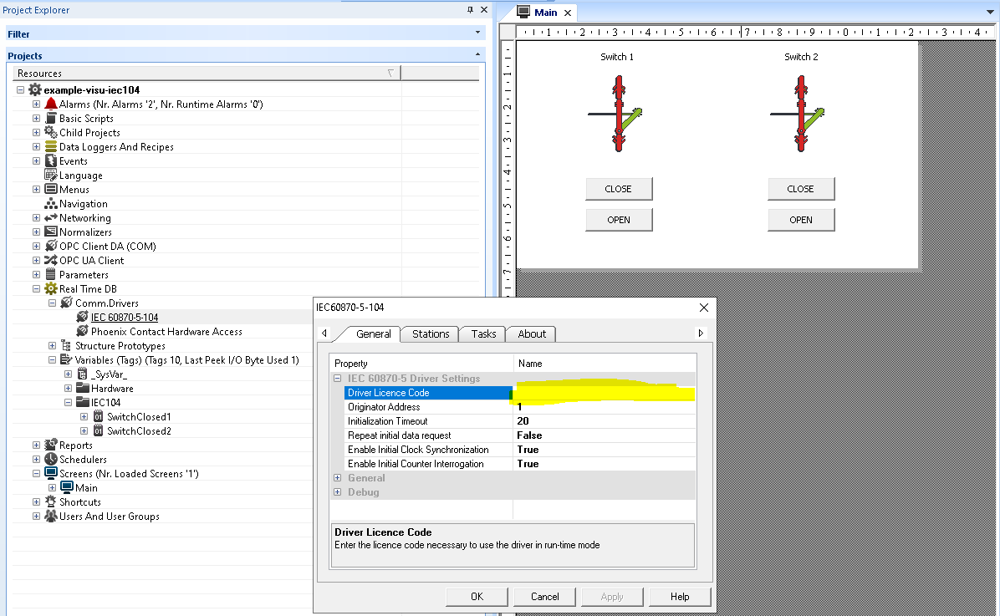
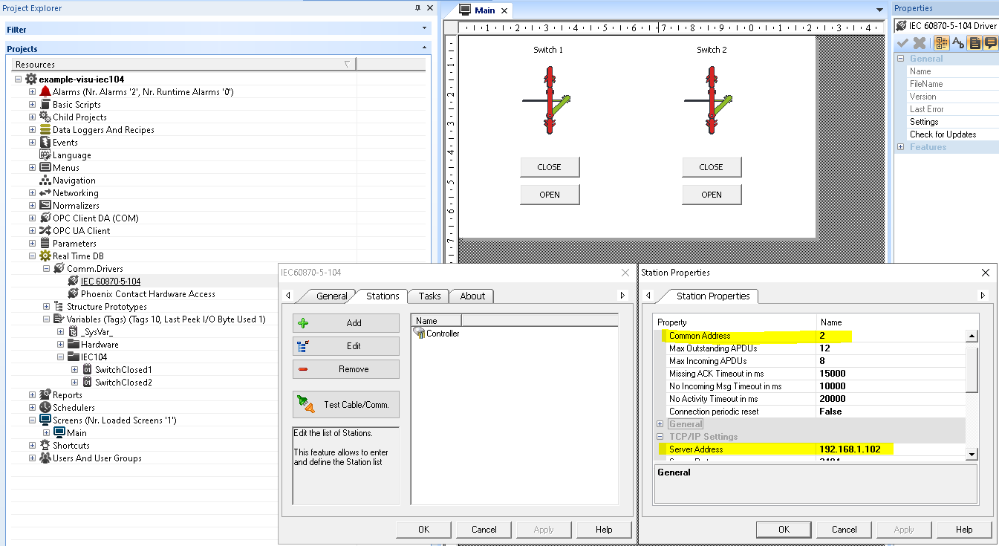
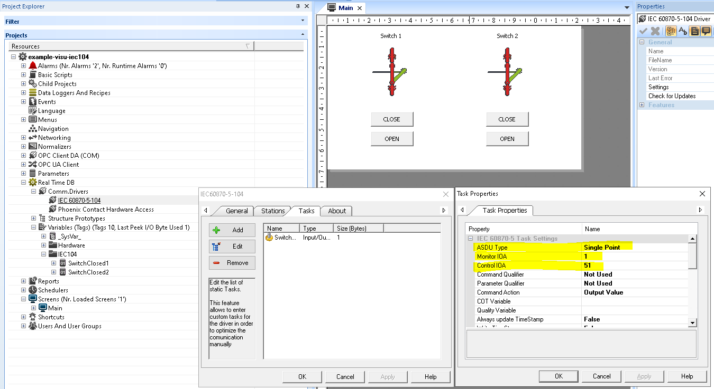
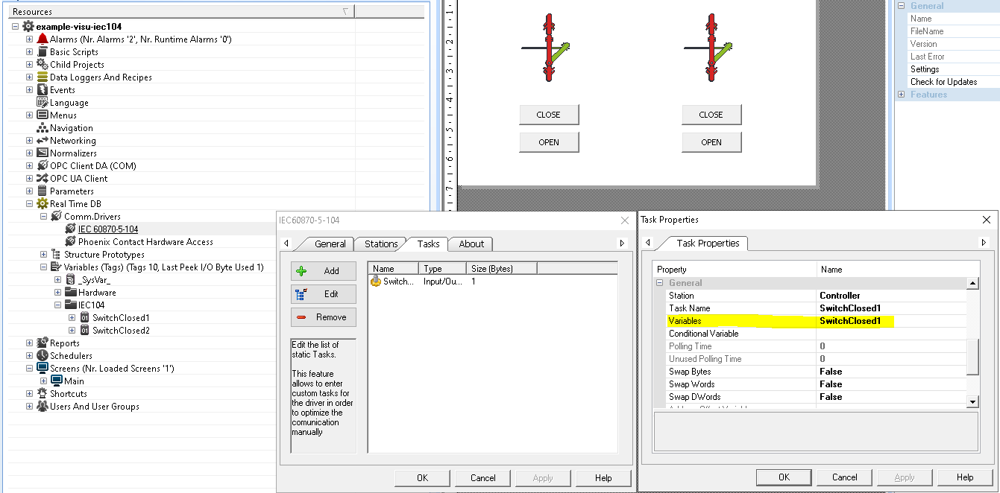
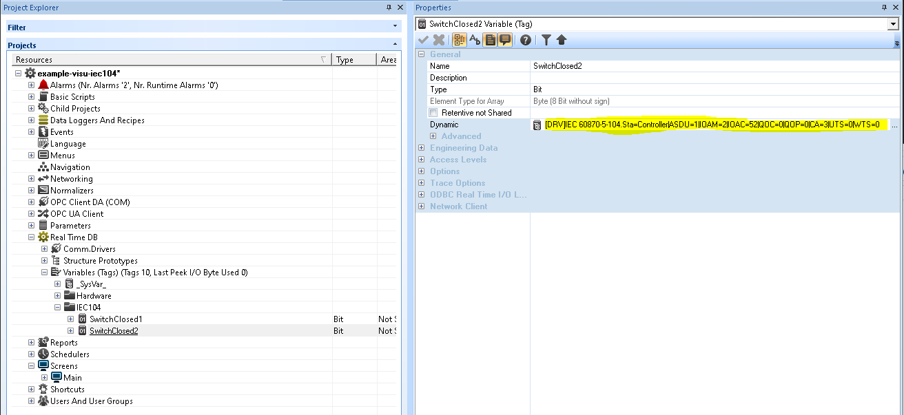
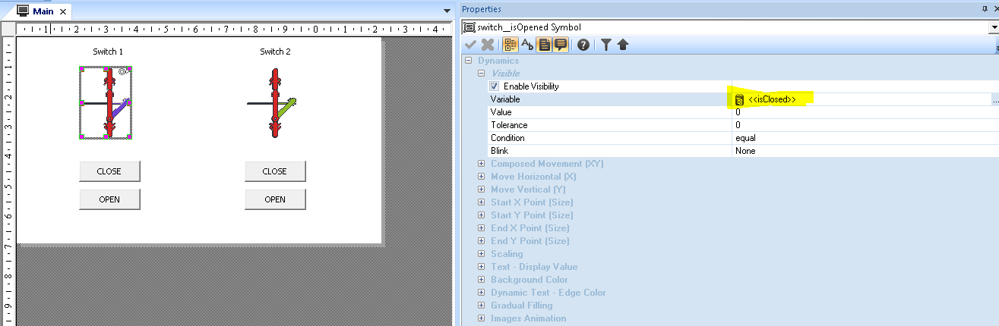
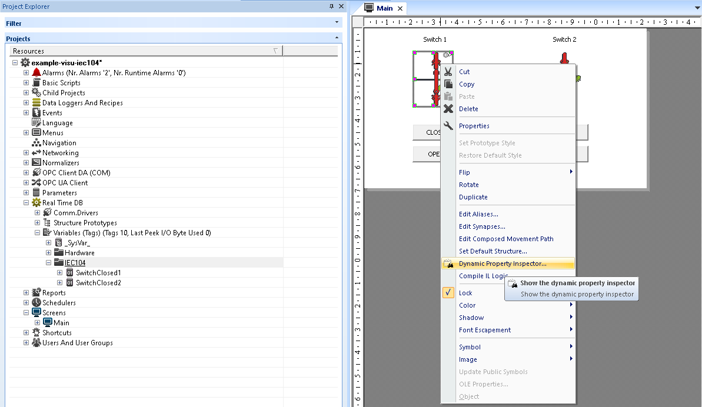
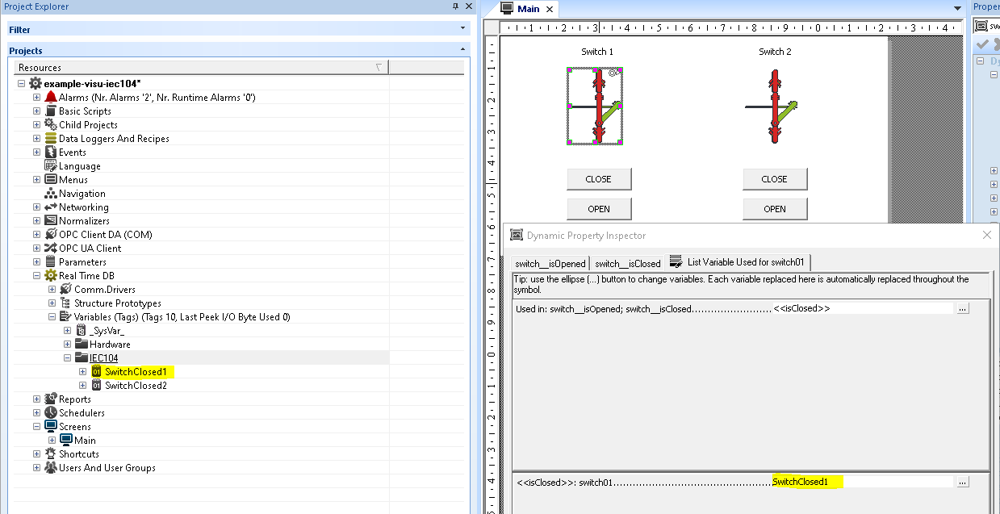
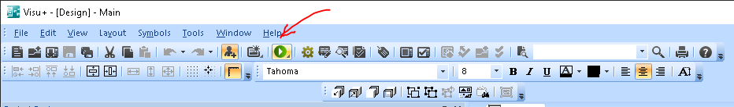
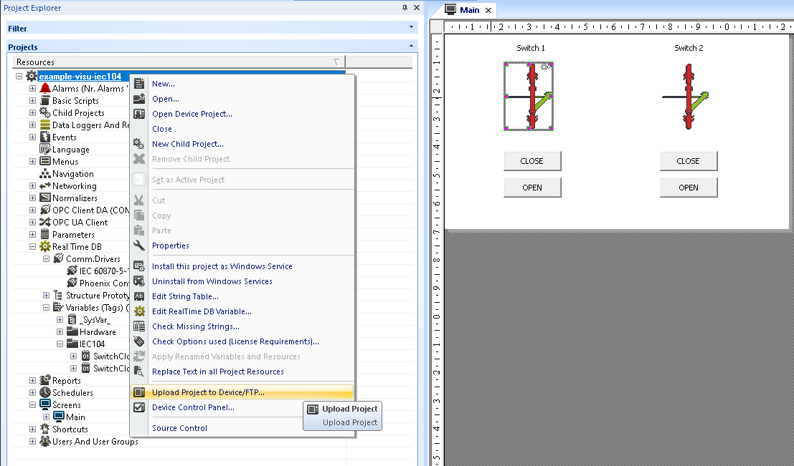

#  Пример использования драйвера IEC 60870-5-104 в Visu+

## Prerequisites
-  [Visu+ 2.52](https://www.phoenixcontact.com/online/portal/ru/?uri=pxc-oc-itemdetail:pid=2988544&&tab=5)
- Лицензионный ключ [2404884 - VISU+ 2 SP IEC 60870 104](https://www.phoenixcontact.com/online/portal/ru/?uri=pxc-oc-itemdetail:pid=2404884&library=ruru&tab=2) (или демонстрационная версия 15 минут)

## Настройка драйвера

### Лицензионный ключ
Вводится в настройках General

### Настройки станции для приема сигналов
На вкладке Stations необходимо создать станцию и задать ей Common Address и Server Address

### Настойка тасков
На вкладке Tasks задаются таски для сопоставления глобальных переменных адресам 104-го протокола. Каждому таску необходимо задать:
-  ASDU Type - тип сигнала (в данном случае Single point)
-  Monitor IOA - адрес для принятия сообщений о сотоянии сигнала
-  Control IOA - адрес для передачи ккоманд управления (для тасков с типом Output)
-  Variables - внутренняя переменная для хранения состояния сигнала

Помимо статических тасков можно создлать и динамические таски - определить привязку переменной к драйверу в свойстве переменной General - Dynamic

Такой способ будет полезен, если сначала сгененировать, или экспортировать из [список переменных](export/tags.csv) из другой утилиты, добавить к нему динамические свойства для перменных, и затем импортировать в Visu+ утилитой из меню Tools - Csv Tag Importer-Exporter.

Подробный Help файл с описанием всех свойств драйвера находится в директории установки Visu+  
`C:\Program Files (x86)\PHOENIX CONTACT\Visu+2.52\Drivers`

## Объекты экрана
У объектов экрана определены динамические свойства специальным синтаксисом.

При группировке оъектов с переменными, определенными таким синтаксисом, сгруппированный объект получает специальный пункт меню, в котором можно определить соответствие внутренней перменной в сгруппированном объекте и глобальной перемненной

## Запуск 
Запуск в режиме отладки с помощью кнопки на панели 

Загрузка в устройство с поддержкой Visu+ Runtime 

